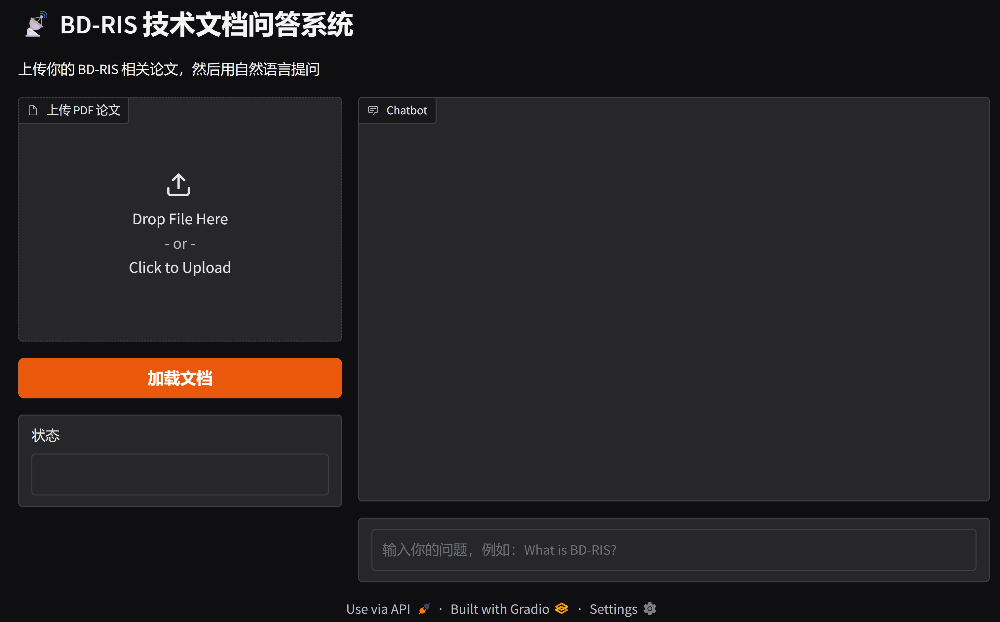

# BD-RIS Technical Paper QA System

A RAG-based question answering system for Beyond-Diagonal Reconfigurable 
Intelligent Surfaces (BD-RIS) research papers.

## Demo


## Features
- Upload BD-RIS related PDF papers
- Ask questions in natural language
- Answers grounded in your uploaded documents

## Requirements
- [Ollama](https://ollama.com) with `qwen2.5:0.5b` and `nomic-embed-text`
- Python 3.11+

## Installation
```bash
pip install -r requirements.txt
ollama pull qwen2.5:0.5b
ollama pull nomic-embed-text
python app.py
```

## Tech Stack
- LangChain + ChromaDB (RAG pipeline)
- Ollama (local LLM)
- Gradio (web interface)

